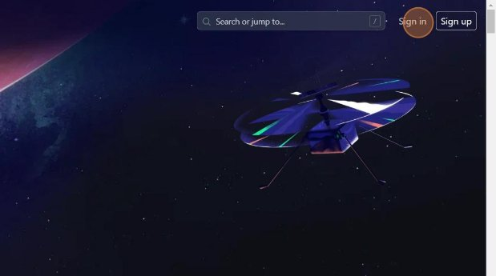
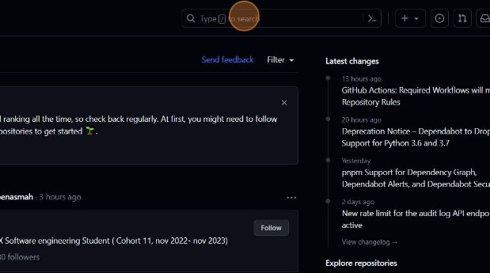
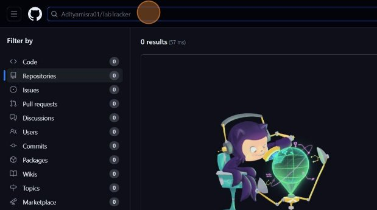
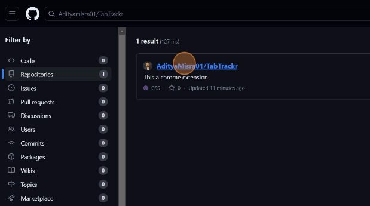
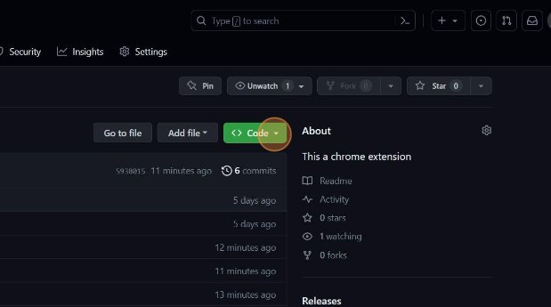
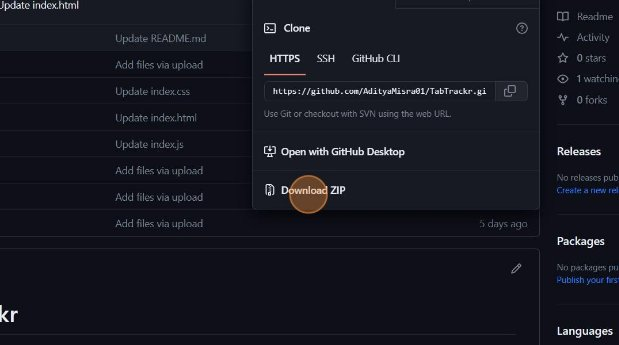

**How to load the extension **

1  Navigate to [www.google.com](https://www.google.com/)![ref1]
1  Click "GitHub: Let's build from here · GitHub"![ref1]
1  Click "Sign in"
4  Click "Type / to search"![ref2]
4  Type "Adityamisra01/TabTracker **ENTER**"![ref3]
6  Click here.![ref2]
6  Click "AdityaMisra01"
8  Double-click "Code"![ref2]
8  Click "Code"![ref3]
10  Click "Download ZIP"![ref2]
10  Extract it![ref3]
10  Then go to chrome://extensions/![ref3]
10  Switch on developer mode from top right corner![ref3]
10  Click on Load unpacked from top left corner![ref3]

only load the extracted folder as it is.

15  You are done enjoy your traker
Made with Scribe - https://scribehow.com 6

[ref1]: Aspose.Words.980067c5-5173-4f2d-9c2e-c4df1f6b967a.002.png
[ref2]: Aspose.Words.980067c5-5173-4f2d-9c2e-c4df1f6b967a.005.png
[ref3]: Aspose.Words.980067c5-5173-4f2d-9c2e-c4df1f6b967a.007.png
